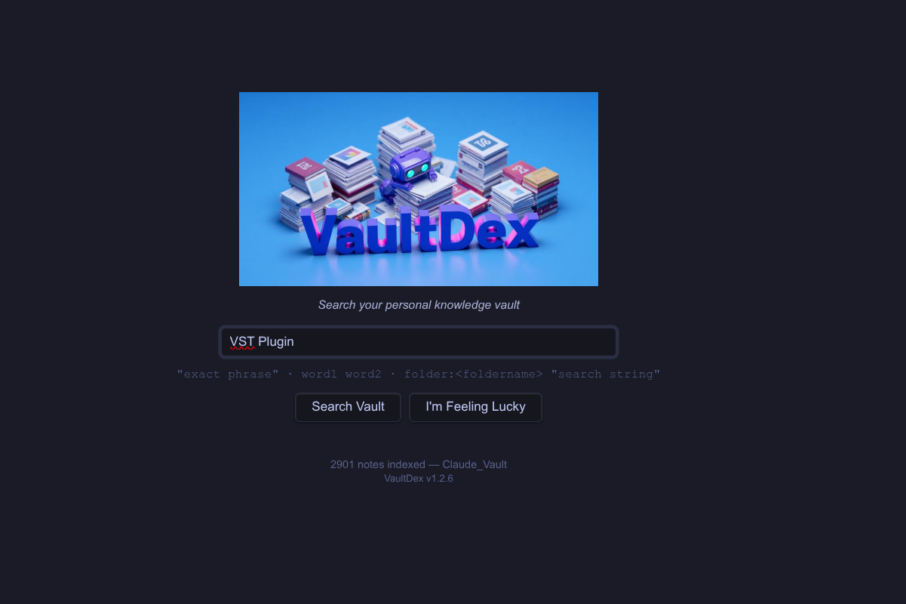
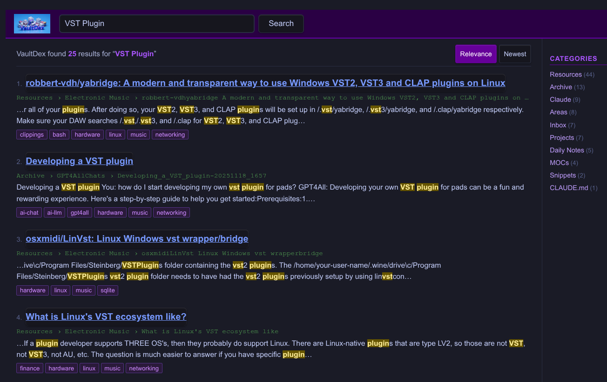

  

# VaultDex

A retro-styled, relevance-scored full-text search engine for your Obsidian vault — inspired by the classic web search engines of the early internet.

> **Search your personal knowledge vault**

---

## Screenshots

  
   <em>Home page</em>

  
   <em>Search results</em>

---

## Overview

VaultDex brings a fast, Google-style search experience to Obsidian. It opens as a full workspace tab, indexes your entire vault on load, and returns ranked results with highlighted snippets, breadcrumb paths, and clickable tags. Results can be filtered by PARA category and sorted by relevance or date.

The aesthetic is intentionally retro — think AltaVista meets your personal knowledge base.

---

## Features

- **Relevance-scored search** — title, tag, header, and body matches are weighted and ranked
- **Highlighted snippets** — matching terms are highlighted in context in each result
- **PARA category sidebar** — filter results by Projects, Areas, Resources, Archive, and more with one click
- **Clickable tags** — click any tag on a result to browse all notes with that tag
- **Sort by Relevance or Newest**
- **I'm Feeling Lucky** — opens a random note from your vault
- **Folder-scoped search** — restrict results to a specific folder with `FolderName:search terms` syntax
- **Phrase and AND search** — supports quoted phrases and multi-word AND queries
- **Theme-adaptive** — uses Obsidian CSS variables; works with any community theme in light or dark mode
- **Fast** — index builds on vault load with no noticeable delay
- **Mobile-compatible** — `isDesktopOnly: false`

---

## Installation

### From Community Plugins (recommended)

1. Open Obsidian **Settings → Community Plugins**
2. Disable Restricted Mode if prompted
3. Click **Browse** and search for **VaultDex**
4. Click **Install**, then **Enable**

### Manual

1. Download `main.js`, `styles.css`, and `manifest.json` from the [latest release](../../releases/latest)
2. Copy them into `.obsidian/plugins/vaultdex/` in your vault
3. Enable the plugin under **Settings → Community Plugins**

---

## Usage

Open VaultDex from the **eye icon** in the ribbon, or run **Open VaultDex search** from the Command Palette (`Ctrl/Cmd+P`).

VaultDex opens as a full workspace tab. Your vault index builds automatically in the background — the note count on the home page confirms when it's ready.

### Home page

| Element | Action |
|---|---|
| Search box | Type a query and press Enter or click **Search Vault** |
| I'm Feeling Lucky | Opens a random note from your vault |
| Note count | Shows how many notes are indexed |

### Results page

| Element | Action |
|---|---|
| Logo | Click to return to the home page |
| Category sidebar | Click a category to filter results to that PARA folder |
| All results | Click to clear the category filter |
| Result title | Click to open the note in a new tab |
| Tag chip | Click to browse all notes with that tag |
| Relevance / Newest | Toggle sort order |

---

## Search Syntax

| Syntax | Example | Description |
|---|---|---|
| Single word | `firewall` | Matches notes containing the word |
| Multiple words | `linux firewall` | All words must appear (AND) |
| Exact phrase | `"ssh key"` | Matches the exact phrase |
| Folder scope | `Snippets:music` | Restricts results to folders matching "Snippets" |
| Partial folder name | `Electronic:ambient` | Matches "Electronic Music" folder |
| Combined | `Resources:"ssh key"` | Folder scope with phrase search |

> **Note:** The folder name must appear at the start of the query followed by a colon. It is case-insensitive and matches any folder whose name contains the given string. The legacy `folder:Name search` syntax is also still supported.

---

## Settings

Open **Settings → VaultDex** to configure:

| Setting | Default | Description |
|---|---|---|
| Max results | 50 | Maximum number of results returned per search |
| Excluded folders | *(none)* | Comma-separated list of folders to skip during indexing |

---

## Credits

VaultDex is inspired by the retro aesthetic of early web search engines. The scoring model is adapted from a custom TF-IDF-style ranker built for personal knowledge management.

Built with the [Obsidian Plugin API](https://github.com/obsidianmd/obsidian-api).

---

## License

MIT — see [LICENSE](LICENSE)
